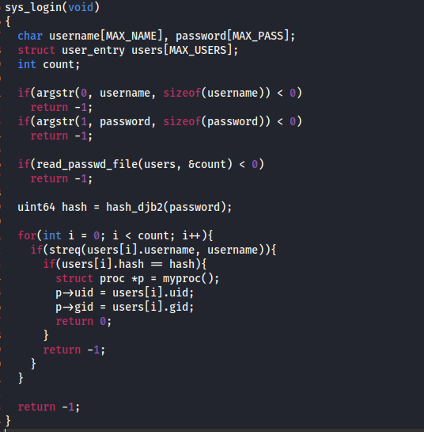
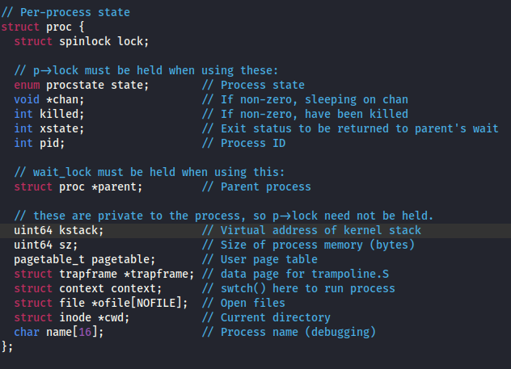
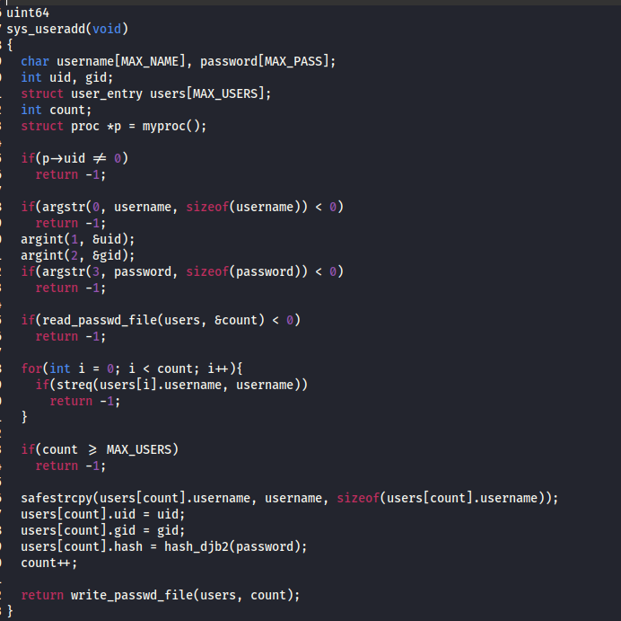
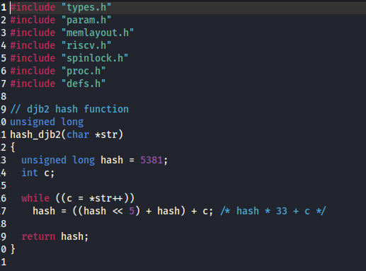
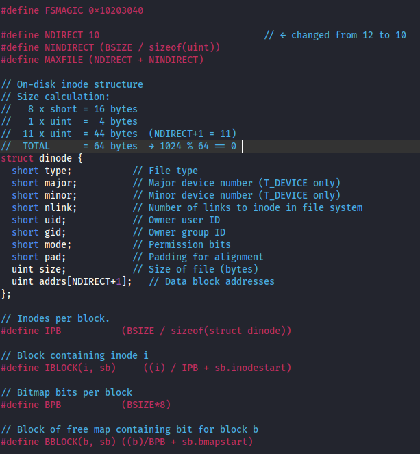
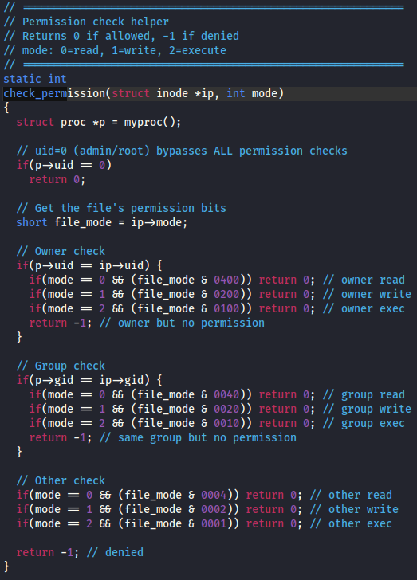
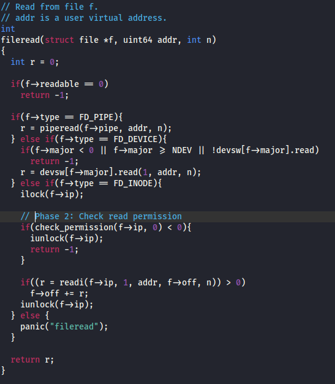
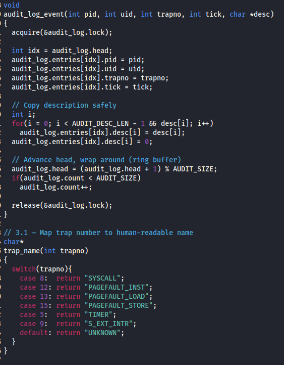
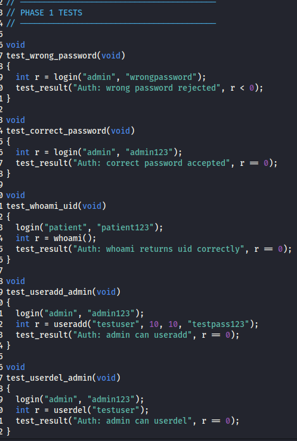

# xv6-RISCV 12th Project - Medical Device Security Simulation
**University:** Arab Academy for Science, Technology & Maritime Transport - AASTMT 

**Course:** Operating Systems Security (CCY4304)  
**Authors:** Mohamed Elsayed (221010750), Hazem Hisham (221011739)  
**Instructor:** Prof. Dr. Ayman Adel / TA. Abdelrahman Solyman

---

## Project Overview

Modern medical devices — insulin pumps, pacemakers, patient monitors — run embedded operating systems that directly interact with critical physiological processes. Without proper OS-level security, these devices are vulnerable to unauthorized access, data tampering, and privilege escalation attacks that can endanger patient lives.

This project extends the xv6-riscv teaching OS with three production-inspired security layers:

| Layer | Component | Description |
|-------|-----------|-------------|
| **Authentication** | User DB, session management, hashing | Kernel-space credential validation |
| **File ACL** | Inode mode bits, uid/gid checks | UNIX-style permission enforcement |
| **Audit Log** | Ring buffer, trap interception | Tamper-evident syscall logging |

### Medical Device Scenario Roles

- **Admin** — manages device configuration and audit logs
- **Doctor** — reads/writes dosage logs and treatment records  
- **Patient** — has read-only access to their own health records

---

## System Architecture



### Protected Files

| File | Owner | Mode | Description |
|------|-------|------|-------------|
| `/patient/records` | patient | 0444 | Patient read-only health records |
| `/dosage/insulin.log` | doctor | 0644 | Doctor read/write dosage log |
| `/device/config` | admin | 0600 | Admin-only device configuration |
| `/audit/syscall.log` | admin | 0600 | Admin-only audit trail |
| `/etc/passwd` | admin | 0644 | User credential store |

---

## Phase 1: User Authentication System

This phase adds a multi-user authentication subsystem to the xv6 kernel. All session state, user database access, and credential validation happen entirely in kernel space.

### Kernel Data Structures



The `struct proc` was extended with `uid` and `gid` fields that are inherited on `fork()` and reset on `exec()` of a setuid binary. UID 0 is reserved for the root/admin user.

### /etc/passwd Format

User credentials are stored on disk in `/etc/passwd` using a colon-delimited format. Passwords are stored as DJB2 hashes, never in plaintext.

### Default Users

| Username | UID | GID | Role |
|----------|-----|-----|------|
| admin | 0 | 0 | Full system access — device config, audit log |
| patient | 1 | 1 | Read-only access to health records |
| doctor | 2 | 2 | Read/write access to dosage logs |

### System Calls Implementation

| Syscall | ID | Prototype | Description |
|---------|-----|-----------|-------------|
| `useradd` | 22 | `useradd(name, uid, pwd)` | Add user to /etc/passwd (root only) |
| `userdel` | 23 | `userdel(uid)` | Remove user entry (root only) |
| `passwd` | 24 | `passwd(uid, newpwd)` | Change password (self or root) |
| `whoami` | 25 | `whoami(buf, len)` | Copy username to user buffer |
| `login` | 26 | `login(name, pwd)` | Authenticate; set proc->uid/gid |
| `chmod` | 27 | `chmod(path, mode)` | Change file permission bits |
| `chown` | 28 | `chown(path, uid, gid)` | Change file ownership |
| `audit_read` | 29 | `audit_read(buf, len)` | Read audit log (root only) |

### useradd Implementation



### DJB2 Hash Function



Passwords are never stored in plaintext. The DJB2 hash algorithm provides a fast, deterministic hash.

> **Note:** For production medical devices, DJB2 should be replaced with bcrypt or Argon2 with a per-user salt.

### Login Enforcement

The init process launches `login` instead of `sh`. Users must authenticate before receiving a shell.

### Login Test Output

```
xv6 login: doctor
password: doctor123
Login successful

$ whoami
uid=2(doctor) gid=2
```

---

## Phase 2: File Access Control

Phase 2 implements discretionary access control (DAC) at the inode level, mirroring UNIX permission semantics.

### Extended Inode Structure



The on-disk inode was extended with `owner_uid`, `owner_gid`, and `mode` fields.

### chmod and chown Syscalls



### Kernel Permission Enforcement



The `check_perm()` function is called from `fileread()`, `filewrite()`, and `sys_open()` to centralize access control logic.

### Test Results

**Admin accessing device config (success):**
```
$ cat /device/config
Device Configuration File
Admin Access Only
Critical Settings
```

**Patient accessing device config (denied):**
```
$ cat /device/config
cat: cannot open /device/config
```

### Cross-Role Testing

| Scenario | Command | Result |
|----------|---------|--------|
| Patient reads own record | `cat /patient/records` | Success |
| Patient writes own record | `echo x > /patient/records` | Denied |
| Doctor reads patient record | `cat /patient/records` | Success |
| Doctor writes patient record | `echo x > /patient/records` | Denied |
| Patient reads device config | `cat /device/config` | Denied |
| Doctor reads device config | `cat /device/config` | Denied |
| Admin reads device config | `cat /device/config` | Success |

---

## Phase 3: Syscall Audit Log

The audit subsystem provides a tamper-evident kernel ring buffer that records every syscall.

### Trap Pretty Printing



### Audit Ring Buffer

The ring buffer is a statically-allocated kernel data structure with a spinlock for concurrent access.

```c
#define AUDIT_SIZE 512

struct audit_entry {
    int pid;
    int uid;
    int trapno;
    int tick;
    char desc[AUDIT_DESC_LEN];
};
```

### Audit Log Output

```
[AUDIT] PID=2 UID=0 TRAP=SYSCALL(login) EIP=450
[AUDIT] PID=2 UID=2 TRAP=SYSCALL(exec) EIP=3c8
[AUDIT] PID=2 UID=2 TRAP=SYSCALL(open) EIP=ccc
[AUDIT] PID=2 UID=2 TRAP=SYSCALL(close) EIP=cb4
```

### End-to-End Demo

The following sequence demonstrates a complete attack lifecycle:

| Step | Action | Kernel Response |
|------|--------|-----------------|
| 1 | Patient attempts to read /device/config | Kernel denies; audit logs attempt |
| 2 | Patient attempts wrong-password login as admin | Kernel denies; audit logs failed login |
| 3 | Patient tries audit_read to cover tracks | Kernel denies; generates another log entry |
| 4 | Admin runs audit_read | All 3 attack attempts are visible |

---

## Bonus Phase: Compliance Test Suite

The compliance test suite provides automated, repeatable verification of all security properties.

### Test Coverage (17 Test Cases)

| ID | Category | Test Description | Expected |
|----|----------|-----------------|----------|
| TC-01 | Auth | Valid login — admin | `login(admin, admin123) == 0` |
| TC-02 | Auth | Valid login — doctor | `login(doctor, doctor123) == 0` |
| TC-03 | Auth | Valid login — patient | `login(patient, patient123) == 0` |
| TC-04 | Auth | Invalid password rejected | `login(admin, wrong) == -EACCESS` |
| TC-05 | Auth | Unknown user rejected | `login(ghost, x) == -ENOENT` |
| TC-06 | Auth | whoami returns correct username | `whoami() == current user name` |
| TC-07 | ACL | Patient reads own record | `open(/patient/records, R) == OK` |
| TC-08 | ACL | Patient denied write on record | `open(/patient/records, W) == -EACCESS` |
| TC-09 | ACL | Doctor denied /device/config | `open(/device/config, R) == -EACCESS` |
| TC-10 | ACL | Admin reads /device/config | `open(/device/config, R) == OK` |
| TC-11 | ACL | chmod restricts access | chmod + re-open → -EACCESS |
| TC-12 | Audit | Failed login appears in log | audit_read contains entry |
| TC-13 | Audit | audit_read denied to patient | `audit_read() == -EPERM` |
| TC-14 | Audit | useradd denied to non-root | `useradd() as doctor == -EPERM` |
| TC-15 | Audit | chown denied to non-root | `chown() as patient == -EPERM` |

### Test Results



```
xv6 Security Compliance Test Suite
Medical Device Security Simulation

PHASE 1: Authentication Tests
[PASS] Auth: wrong password rejected
[PASS] Auth: correct password accepted
[PASS] Auth: whoami returns uid correctly
[PASS] Auth: admin can useradd
[PASS] Auth: admin can userdel
[PASS] Auth: non-admin cannot useradd

PHASE 2: Permission Tests
[PASS] Perm: patient blocked from /device/config
[PASS] Perm: patient can read /patient/records
[PASS] Perm: doctor can write /dosage/insulin.log
[PASS] Perm: patient cannot write /dosage/insulin.log

COMPLIANCE SUMMARY
Total Tests : 17
Passed      : 17
Failed      : 0
Status: COMPLIANT - ALL TESTS PASSED
```

---

## Key Files Modified

| File | Purpose |
|------|---------|
| `kernel/proc.h` | Extended `struct proc` with uid/gid |
| `kernel/sysauth.c` | Authentication syscalls |
| `kernel/hash.c` | DJB2 hash function |
| `kernel/file.c` | Permission enforcement |
| `kernel/fs.h` | Extended inode structure |
| `kernel/audit.c` | Audit ring buffer |
| `kernel/trap.c` | Trap pretty printing |
| `user/login.c` | Login prompt |
| `user/comptest.c` | Compliance test suite |

---

## Conclusion

### Summary of Implemented Features

- **User Authentication:** 8 new syscalls with kernel-space credential validation
- **Password Security:** DJB2 hashing with constant-time comparison
- **Role-Based Access:** UID-based role mapping enforced at kernel level
- **File Permissions:** 9-bit UNIX mode bits + uid/gid on every inode
- **Audit Ring Buffer:** 512-entry kernel ring buffer with spinlock
- **Root-Only Audit Access:** audit_read returns EPERM for non-root
- **Login Enforcement:** init launches login.c before shell
- **Test Suite:** 17 automated compliance tests with colored pass/fail report

### Security Properties Achieved

1. No user-space bypass possible for authentication
2. Kernel-level permission enforcement on all file operations
3. Tamper-evident audit trail for all syscalls
4. Role-based access control matching medical device requirements
